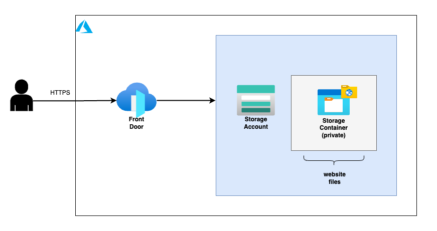

# Static Website

## Infrastructure Diagram


## Upload website files
### Prerequisites
- Install and configure [azcopy](https://docs.microsoft.com/en-us/azure/storage/common/storage-use-azcopy-v10)
- Access "Access Control (IAM)" in your Storage Account and add "Storage Blob Data Owner" role assignment for your user

### Commands
Authenticate:
```
azcopy login
```

Upload files to $web (default) storage container:
```
azcopy cp "<website_directory>/*" "https://<storage_account>.blob.core.windows.net/\$web" --recursive
```

## How to authenticate
```
az login
az account set --subscription "<subscription_id>"
az ad sp create-for-rbac --role="Contributor" --scopes="/subscriptions/<subscription_id>"
```
Get the output from the last command above and set variables:

```
export ARM_CLIENT_ID="<appId>"
export ARM_CLIENT_SECRET="<password>"
export ARM_SUBSCRIPTION_ID="<subscriptionID>"
export ARM_TENANT_ID="<tenant>"
```
## Update Infrastructure - Terragrunt commands
```
cd samples/3-tier/Infrastructure/azure/terragrunt/subscription-bench/<environment>/<region>/
terragrunt plan --terragrunt-working-dir static-website
terragrunt apply -auto-approve --terragrunt-working-dir static-website
```