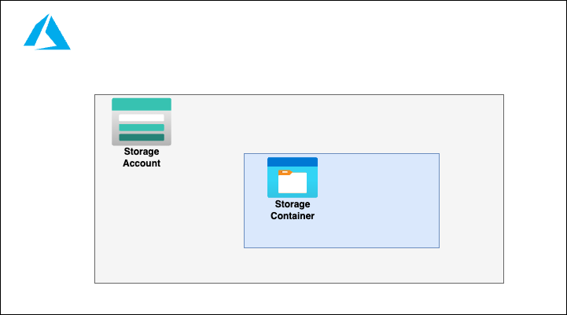

# Storage Container

## Infrastructure Diagram


## How to authenticate
```
az login
az account set --subscription "<subscription_id>"
az ad sp create-for-rbac --role="Contributor" --scopes="/subscriptions/<subscription_id>"
```
Get the output from the last command above and set variables:

```
export ARM_CLIENT_ID="<appId>"
export ARM_CLIENT_SECRET="<password>"
export ARM_SUBSCRIPTION_ID="<subscriptionID>"
export ARM_TENANT_ID="<tenant>"
```
## Update Infrastructure - Terragrunt commands
```
cd iac/azure/terragrunt/subscription-sample/<environment>/<region>/
terragrunt plan --terragrunt-working-dir storage-container
terragrunt apply -auto-approve --terragrunt-working-dir storage-container
```